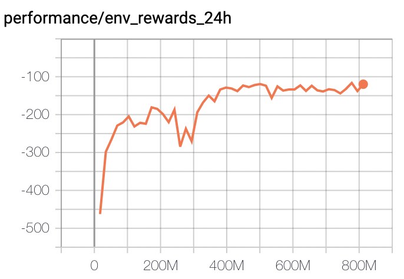
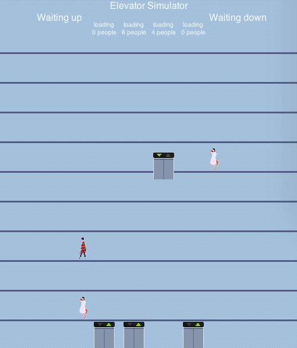

# LiftSim基线

## 简介

基于PARL库实现A2C算法，应用于[RLSchool][rlschool]库中的电梯调度模拟环境[LiftSim][liftsim]。

## 依赖库

+ [paddlepaddle>=1.6.1](https://github.com/PaddlePaddle/Paddle)
+ [parl](https://github.com/PaddlePaddle/PARL)
+ [rlschool>=0.1.1][rlschool]

Windows版本仅支持Python3.5及以上版本。

## 分布式训练

首先，启动一个具有5个CPU资源的本地集群：

```bash
xparl start --port 8010 --cpu_num 5
```

> 注意，如果你已经启动了一个集群，则不需要重复运行上面命令。关于PARL集群更多信息，可以参考[文档](https://parl.readthedocs.io/en/latest/parallel_training/setup.html)。

然后我们就可以通过运行下面命令进行分布式训练：

```bash
python train.py
```

## 收敛指标
在GPU上训练30h左右，评估指标能达到-120分左右（LiftSim环境运行1天reward）


## 可视化效果



[rlschool]: https://github.com/PaddlePaddle/RLSchool
[liftsim]: https://github.com/PaddlePaddle/RLSchool/tree/master/rlschool/liftsim
