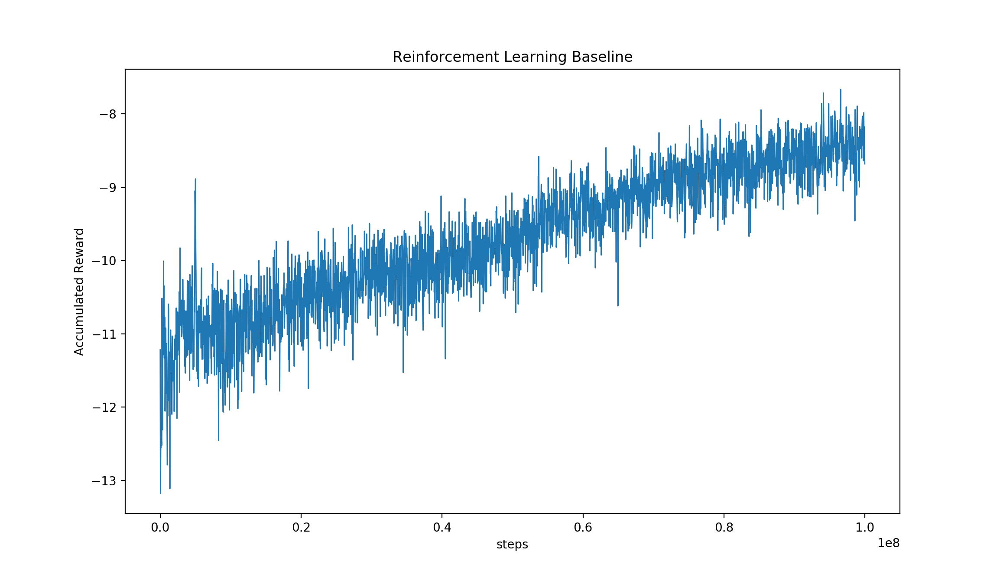

# LiftSim基线

## 简介

基于PARL库实现Deep Q-network算法，应用于[RLSchool][rlschool]库中的电梯调度模拟环境[LiftSim][liftsim]。

## 依赖库

- paddlepaddle==1.5.1
- parl==1.1.2
- rlschool>=0.0.1

Windows版本仅支持Python3.5及以上版本。

## 运行

```python
python demo.py
```

## Benchmark



Accumulated Reward：每3600 steps内reward的总和，可体现电梯调度在单位时间（模拟环境0.5小时）内的效率。

[rlschool]: https://github.com/PaddlePaddle/RLSchool
[liftsim]: https://github.com/PaddlePaddle/RLSchool/tree/master/rlschool/liftsim
