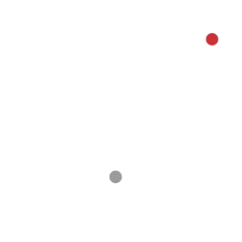
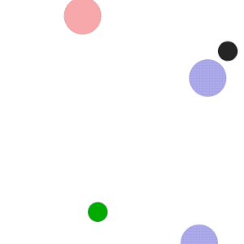
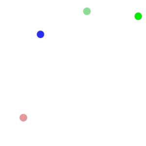
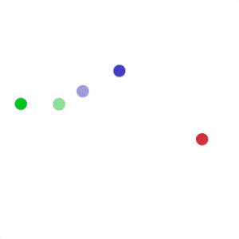
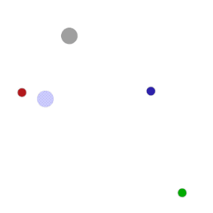
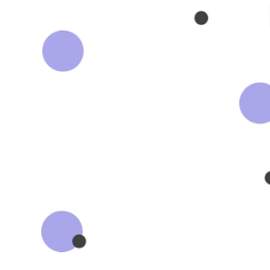
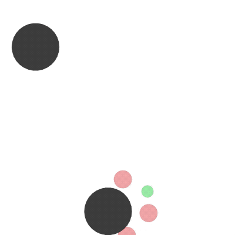
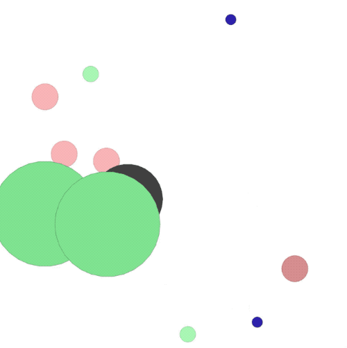

## Reproduce MADDPG with PARL
Based on PARL, the MADDPG algorithm of deep reinforcement learning has been reproduced.

> Paper: MADDPG in [ Multi-Agent Actor-Critic for Mixed Cooperative-Competitive Environments](https://arxiv.org/abs/1706.02275)

### Multi-agent particle environment introduction
A simple multi-agent particle world based on gym. Please see [here](https://github.com/openai/multiagent-particle-envs) to install and know more about the environment.

### Benchmark result
Mean episode reward (every 1000 episodes) in training process (totally 25000 episodes).

<p align="center">

</p>

### Experiments result

<table>
<tr>
<td>
simple<br>

</td>
<td>
simple_adversary<br>

</td>
<td>
simple_push<br>

</td>
<td>
simple_reference<br>

</td>
</tr>
<tr>
<td>
simple_speaker_listener<br>

</td>
<td>
simple_spread<br>

</td>
<td>
simple_tag<br>

</td>
<td>
simple_world_comm<br>

</td>
</tr>
</table>

## How to use
### Dependencies:
+ python3.5+
+ [paddlepaddle>=2.0.0](https://github.com/PaddlePaddle/Paddle)
+ [parl>=2.0.2](https://github.com/PaddlePaddle/PARL)
+ [multiagent-particle-envs](https://github.com/openai/multiagent-particle-envs)
+ gym==0.10.5

### Start Training:
```
# To train an agent for simple_speaker_listener scenario
python train.py

# To train for other scenario, model is automatically saved every 1000 episodes
# python train.py --env [ENV_NAME]

# To show animation effects after training
# python train.py --env [ENV_NAME] --show --restore
