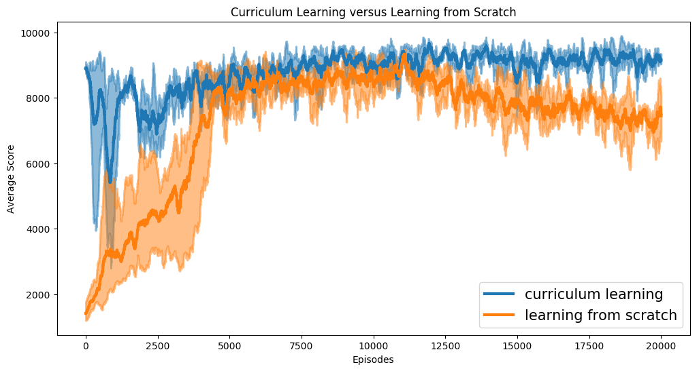

# The Winning Solution for the NeurIPS 2018: AI for Prosthetics Challenge
<p align="center">

</p>

This folder contains the winning solution of our team `Firework` in the NeurIPS 2018: AI for Prosthetics Challenge. It consists of three parts. The first part is our final submitted model, a sensible controller that can follow random target velocity. The second part is used for curriculum learning, to learn a natural and efficient gait at low-speed walking. The last part learns the final agent in the random velocity environment for round2 evaluation.

For more technical details about our solution, we provide:
1. [[Link]](https://youtu.be/RT4JdMsZaTE) An interesting video demonstrating the training process visually.
2. [[Link]](https://docs.google.com/presentation/d/1n9nTfn3EAuw2Z7JichqMMHB1VzNKMgExLJHtS4VwMJg/edit?usp=sharing) A PowerPoint Presentation briefly introducing our solution in NeurIPS2018 competition workshop.
3. [[Link]](https://drive.google.com/file/d/1W-FmbJu4_8KmwMIzH0GwaFKZ0z1jg_u0/view?usp=sharing) A poster briefly introducing our solution in NeurIPS2018 competition workshop.
3. (coming soon)A full academic paper detailing our solution, including entire training pipline, related work and experiments that analyze the importance of each key ingredient.

**Note**: Reproducibility is a long-standing issue in reinforcement learning field. We have tried to guarantee that our code is reproducible, testing each training sub-task three times. However, there are still some factors that prevent us from achieving the same performance. One problem is the choice time of a convergence model during curriculum learning. Choosing a sensible and natural gait visually is crucial for subsequent training, but the definition of what is a good gait varies from person to person.

<p align="center">

</p>

## Dependencies
- python3.6
- [parl==1.0](https://github.com/PaddlePaddle/PARL)
- [paddlepaddle==1.5.1](https://github.com/PaddlePaddle/Paddle)
- [osim-rl](https://github.com/stanfordnmbl/osim-rl)
- [grpcio==1.12.1](https://grpc.io/docs/quickstart/python.html)
- tqdm
- tensorflow (To use tensorboard)

## Part1: Final submitted model
### Result
For final submission, we test our model in 500 CPUs, running 10 episodes per CPU with different random seeds.

| Avg reward of all episodes | Avg reward of complete episodes | Falldown % | Evaluate episodes |
|----------------------------|---------------------------------|------------|-------------------|
| 9968.5404                  | 9980.3952                       | 0.0026     | 5000              |

### Test
- How to Run

  1. Enter the sub-folder `final_submit`
  2. Download the model file from online storage service, [Baidu Pan](https://pan.baidu.com/s/1NN1auY2eDblGzUiqR8Bfqw) or [Google Drive](https://drive.google.com/open?id=1DQHrwtXzgFbl9dE7jGOe9ZbY0G9-qfq3) 
  3. Unpack the file by using: 
           `tar zxvf saved_model.tar.gz`
  4. Launch the test script: 
           `python test.py`

## Part2: Curriculum learning

<p align="center">

</p>

#### 1. Target: Run as fast as possible

<p align="center">

</p>

```bash
# server
python simulator_server.py --port [PORT] --ensemble_num 1 

# client (Suggest: 200+ clients)
python simulator_client.py --port [PORT] --ip [SERVER_IP] --reward_type RunFastest
```

#### 2. Target: run at 3.0 m/s

```bash
# server
python simulator_server.py --port [PORT] --ensemble_num 1 --warm_start_batchs 1000 \
           --restore_model_path [RunFastest model]

# client (Suggest: 200+ clients)
python simulator_client.py --port [PORT] --ip [SERVER_IP] --reward_type FixedTargetSpeed --target_v 3.0 \
           --act_penalty_lowerbound 1.5 
```

#### 3. target: walk at 2.0 m/s

```bash
# server
python simulator_server.py --port [PORT] --ensemble_num 1 --warm_start_batchs 1000 \
           --restore_model_path [FixedTargetSpeed 3.0m/s model]

# client (Suggest: 200+ clients)
python simulator_client.py --port [PORT] --ip [SERVER_IP] --reward_type FixedTargetSpeed --target_v 2.0 \
           --act_penalty_lowerbound 0.75 
```

#### 4. target: walk slowly at 1.25 m/s

<p align="center">

</p>

```bash
# server
python simulator_server.py --port [PORT] --ensemble_num 1 --warm_start_batchs 1000 \
           --restore_model_path [FixedTargetSpeed 2.0m/s model]  

# client (Suggest: 200+ clients)
python simulator_client.py --port [PORT] --ip [SERVER_IP] --reward_type FixedTargetSpeed --target_v 1.25 \
           --act_penalty_lowerbound 0.6
```

## Part3: Training in random velocity environment for round2 evaluation
As mentioned before, the selection of model that used to fine-tune influence later training. For those who can not obtain expected performance by former steps, a pre-trained model that walk naturally at 1.25m/s is provided. ([Baidu Pan](https://pan.baidu.com/s/1PVDgIe3NuLB-4qI5iSxtKA) or [Google Drive](https://drive.google.com/open?id=1jWzs3wvq7_ierIwGZXc-M92bv1X5eqs7))

```bash
# server
python simulator_server.py --port [PORT] --ensemble_num 12 --warm_start_batchs 1000 \
           --restore_model_path [FixedTargetSpeed 1.25m/s model] --restore_from_one_head 

# client (Suggest: 100+ clients)
python simulator_client.py --port [PORT] --ip [SERVER_IP] --reward_type Round2 --act_penalty_lowerbound 0.75 \
           --act_penalty_coeff 7.0 --vel_penalty_coeff 20.0 --discrete_data --stage 3
```

### Test trained model

```bash
python test.py --restore_model_path [MODEL_PATH] --ensemble_num [ENSEMBLE_NUM]
```

### Other implementation details

<p align="center">

</p>

Following the above steps correctly, you can get an agent that scores around 9960, socring slightly poorer than our final submitted model. The score gap results from the lack of multi-stage-training paradigm. As shown in the above Firgure, the distribution of possible target velocity keeps changing throughout the entire episode, degrading the performance a single model due to the convetional conpept that it's hard to fit a model under different data distributions. Thus we actually have trained 4 models that amis to perform well in different velocity disstribution. These four models are trained successively, this is, we train a model that specializes in start stage(first 60 frames), then fix this start model at first 60 frames, and train another model for rest 940 frames. We do not provide this part of the code, since it reduces the readability of the code. Feel free to post issue if you have any problems :)


## Acknowledgments
We would like to thank Zhihua Wu, Jingzhou He, Kai Zeng for providing stable computation resources and other colleagues on the Online Learning team for insightful discussions. We are grateful to Tingru Hong, Wenxia Zheng and others for creating a vivid and popular demonstration video.
