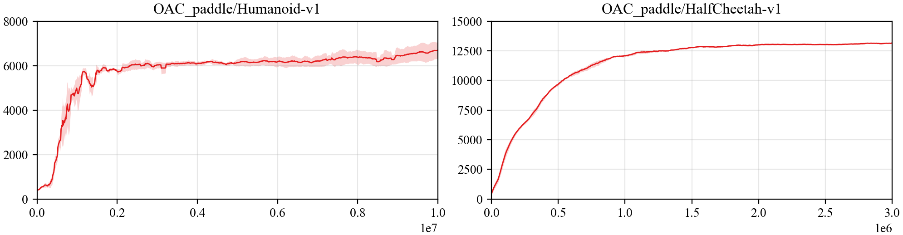

## Reproduce OAC with PARL
Based on PARL, the OAC algorithm of deep reinforcement learning has been reproduced, reaching the same level of indicators as the paper in Mujoco benchmarks.

> Paper: OAC in [Better Exploration with Optimistic Actor-Critic](https://arxiv.org/abs/1910.12807)

### Mujoco games introduction
Please see [here](https://github.com/openai/mujoco-py) to know more about Mujoco games.

### Benchmark result



## How to use
### Dependencies:
+ python3.5+
+ [parl>=2.0.0](https://github.com/PaddlePaddle/PARL)
+ [paddlepaddle>=2.0.0](https://github.com/PaddlePaddle/Paddle)
+ gym==0.9.1
+ mujoco-py==0.5.7

### Start Training:
```
# To train an agent for Humanoid-v1 game
python train.py

# To train for other game
python train.py --env [ENV_NAME]
