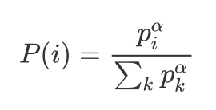
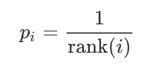
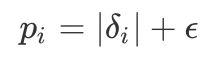

## Prioritized Experience Replay
Reproducing paper [Prioritized Experience Replay](https://arxiv.org/abs/1511.05952).

Prioritized experience replay (PER) develops a framework for prioritizing experience, so as to replay important transitions more frequently. In original paper, the authors define the probability of sampling transition *i* as:

<p align="center">
   
</p>

Where p_i > 0 is the priority of transition *i*. The exponent alpha determines how much prioritization is used, with alpha = 0 corresponding to the uniform case. There are two variants:

### rank-based

<p align="center">
   
</p>

where rank(*i*) is the rank of transition *i* when the replay memory is sorted to delta_i （absolute TD-error of transition *i*）. We use the binary heap as an approximation of the sorted array.

### proportional

<p align="center">
   
</p>

where epsilon is a small positive number used to avoid the extreme case when the TD-error is 0 and the transition will never be sampled. We implement it with sum tree that is also efficient to sample and update.

## How to use

### Dependencies:
+ [paddlepaddle>=1.6.1](https://github.com/PaddlePaddle/Paddle)
+ [parl](https://github.com/PaddlePaddle/PARL)
+ gym[atari]
+ tqdm
+ atari-py
+ [ale_python_interface](https://github.com/mgbellemare/Arcade-Learning-Environment)


### Start Training:
Train on BattleZone game with DDQN and rank-based PER:
```bash
python train.py --rom ./rom_files/battle_zone.bin --alg ddqn --prior_type rank --exp_name run_train
```

> To train on more games, you can install more rom files from [here](https://github.com/openai/atari-py/tree/master/atari_py/atari_roms).

