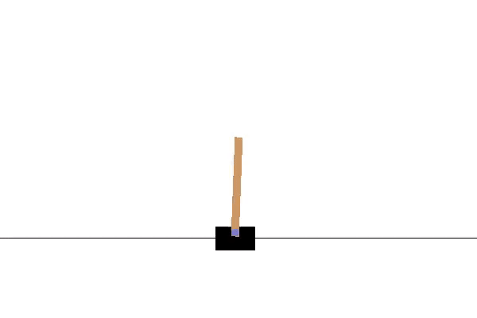

## Paddle benchmark Quick Start
Train an agent with PARL to solve the CartPole problem, a classical benchmark in RL.

## How to use
### Dependencies:

+ [parl>=2.0.0](https://github.com/PaddlePaddle/PARL)
+ paddlepaddle>=2.0.0
+ gym

### Start Training:
```
python train.py  
```

### Expected Result


The agent can get around 200 points in a few seconds.
