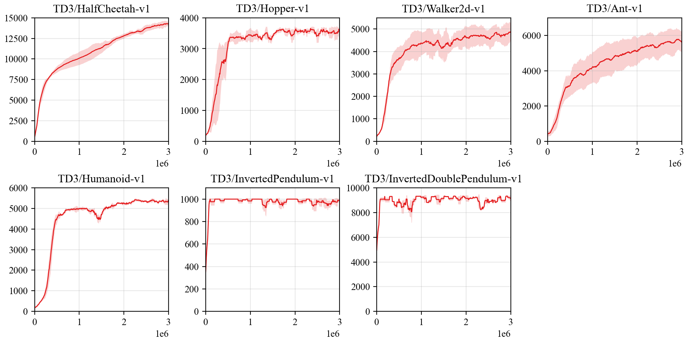

## Reproduce TD3 with PARL
Based on PARL, the TD3 algorithm of deep reinforcement learning has been reproduced, reaching the same level of indicators as the paper in Mujoco benchmarks.

Include following improvements:
+ Clipped Double Q-learning
+ Target Networks and Delayed Policy Update
+ Target Policy Smoothing Regularization

> TD3 in
[Addressing Function Approximation Error in Actor-Critic Methods](https://arxiv.org/abs/1802.09477)

### Mujoco games introduction
Please view [here](https://github.com/openai/mujoco-py) to know more about Mujoco games.

### Benchmark result


+ Each experiment was run three times with different seeds

## How to use
### Dependencies:
+ python3.5+
+ [parl>=2.0.0](https://github.com/PaddlePaddle/PARL)
+ [paddlepaddle>=2.0.0](https://github.com/PaddlePaddle/Paddle)
+ gym==0.9.1
+ mujoco-py==0.5.7

### Start Training:
```
# To train an agent for HalfCheetah-v1 game
python train.py

# To train for different game
python train.py --env [ENV_NAME]
