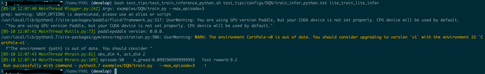

# Linux GPU/CPU 基础训练推理测试

Linux GPU/CPU 基础训练推理测试的主程序为`test_train_inference_python.sh`，可以测试基于Python的模型训练、评估、推理等基本功能。

## 1. 测试结论汇总

- 训练相关：

| 算法名称 | 模型名称 | 单机单卡 | 单机多卡 |
|  :----: |   :----:  |    :----:  |  :----:   |
| A2C            | A2C            | 正常训练 | 正常训练 |
| CQL            | CQL            | 正常训练 | 正常训练 |
| DDPG           | DDPG           | 正常训练 | 正常训练 |
| DQN            | DQN            | 正常训练 | 正常训练 |
| DQN_varient    | DQN_varient    | 正常训练 | 正常训练 |
| ES             | ES             | 正常训练 | 正常训练 |
| MADDPG         | MADDPG         | 正常训练 | 正常训练 |
| OAC            | OAC            | 正常训练 | 正常训练 |
| PPO            | PPO            | 正常训练 | 正常训练 |
| PolicyGradient | QuickStart     | 正常训练 | 正常训练 |
| SAC            | SAC            | 正常训练 | 正常训练 |
| TD3            | TD3            | 正常训练 | 正常训练 |


## 2. 测试流程

### 2.1 准备数据

用于基础训练推理测试的环境全部在prepare.sh里安装完成

### 2.2 准备环境


- 安装PaddlePaddle：如果您已经安装了2.2或者以上版本的paddlepaddle，那么无需运行下面的命令安装paddlepaddle。
    ```
    # 需要安装2.2及以上版本的Paddle
    # 安装GPU版本的Paddle
    pip install paddlepaddle-gpu==2.2.0
    # 安装CPU版本的Paddle
    pip install paddlepaddle==2.2.0
    ```

### 2.3 功能测试


测试方法如下所示，希望测试不同的模型文件，只需更换为自己的参数配置文件，即可完成对应模型的测试。

```bash
bash test_tipc/test_train_inference_python.sh ${your_params_file} lite_train_lite_infer
```

以`DQN`的`Linux GPU/CPU 基础训练推理测试`为例，命令如下所示。

```bash
bash test_tipc/prepare.sh test_tipc/configs/DQN/train_infer_python.txt lite_train_lite_infer
```

```bash
bash test_tipc/test_train_inference_python.sh test_tipc/configs/DQN/train_infer_python.txt lite_train_lite_infer
```

输出结果如下，表示命令运行成功。

```bash
Run successfully with command - python3.7 examples/DQN/train.py   --max_episode=3    !
```

在开启benchmark参数时，可以得到测试的详细数据，包含运行环境信息（系统版本、CUDA版本、CUDNN版本、驱动版本），Paddle版本信息，参数设置信息（运行设备、线程数、是否开启内存优化等），模型信息（模型名称、精度），数据信息（batchsize、是否为动态shape等），性能信息（CPU,GPU的占用、运行耗时、预处理耗时、推理耗时、后处理耗时），如下图所示

<div align="center">
    
</div>


如果运行失败，也会在终端中输出运行失败的日志信息以及对应的运行命令。可以基于该命令，分析运行失败的原因。
